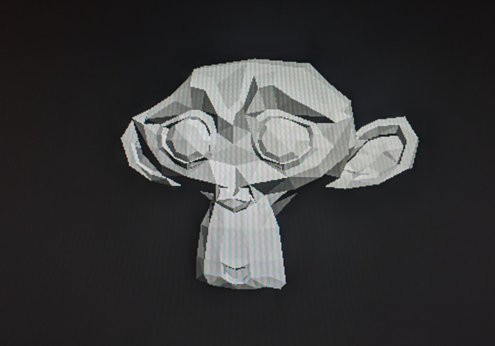
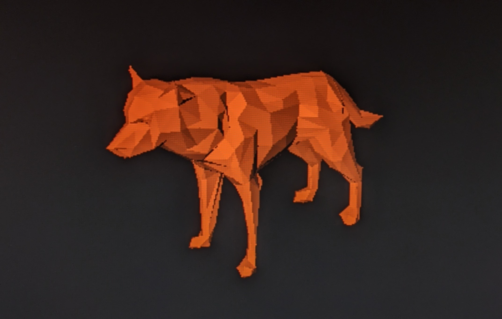
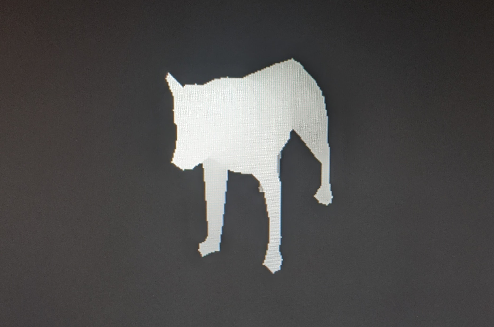
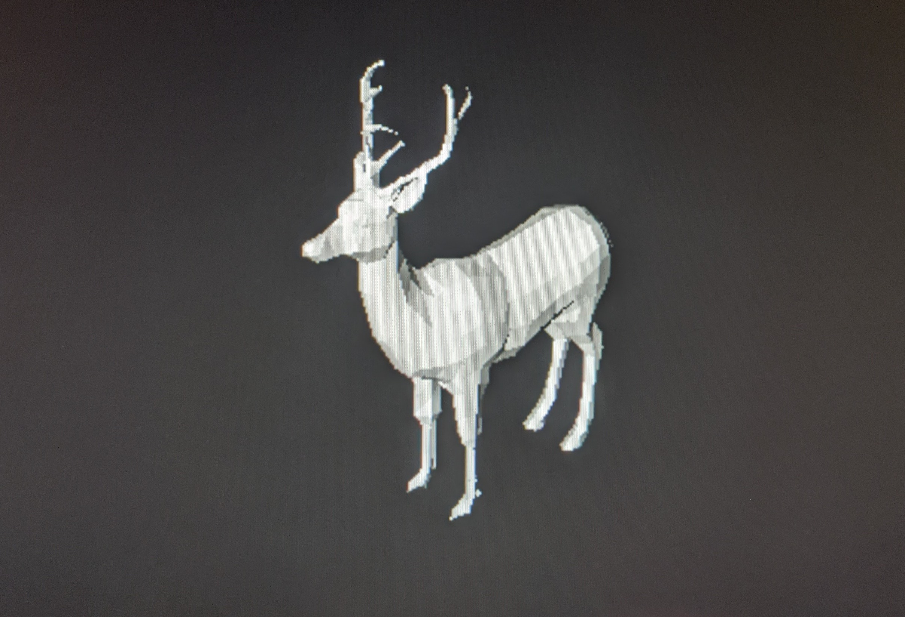

# 3DOVE: 3D Object Viewer

A 3D object viewer that runs on a bare-metal Raspberry Pi (no standard libraries).

Created for the Stanford CS107e final project (Winter 2021).

## Contributors
Ari Webb ([AriWebb](https://github.com/AriWebb))

Tejas Narayanan ([tnarayanan](https://github.com/tnarayanan))

## Features
* Fast triangle rendering using z-buffers
* Directional lighting
* Loading .obj files from file system
* Moving camera around model using arrow keys

**Upcoming**
* GPU acceleration

## Dependencies

Requires the [`libpi`](http://cs107e.github.io/header) set of libraries built in CS107e, which includes implementations of standard library methods as well as some extras:
* Strings (`strlen`, `strlcat`, `printf`)
* Memory (`memset`, `memcpy`, `malloc`)
* GPIO
* Graphics (mailbox, framebuffer, drawing)
* Keyboard (PS2 interface)

## References

### Rendering concepts/math
* Pat Hanrahan's wonderful advice!
* Perspective projection: https://www.scratchapixel.com/lessons/3d-basic-rendering/rendering-3d-scene-overview/perspective-projection
* Camera/view matrices: https://www.3dgep.com/understanding-the-view-matrix/#Look_At_Camera

### Math library
* Square root calculation method: https://en.wikipedia.org/wiki/Methods_of_computing_square_roots#Babylonian_method

### 3D Models
* Monkey: Blender default shape (https://www.blender.org/)
* Wolf: https://free3d.com/3d-model/low-poly-wolf-71850.html
* Goat: https://free3d.com/3d-model/low-poly-goat-35241.html
* Cat: https://free3d.com/3d-model/low-poly-cat-46138.html
* Deer: https://free3d.com/3d-model/low-poly-deer-87801.html

### GPU Library
* VideoCore IV assembler/example programs: https://github.com/hermanhermitage/videocoreiv
  * The `tinyasm` module (GPU assembler) is from this repository. No additional changes were made.
* Mailbox properties documentation: https://github.com/raspberrypi/firmware/wiki/Mailbox-property-interface
* Example of bare metal program that uses mailbox to get Raspberry Pi's serial number: https://github.com/bztsrc/raspi3-tutorial/tree/master/04_mailboxes
  * Used this code to understand how to use the mailbox to communicate with the GPU. No code was taken from this repository.
* Example program to peek/poke a memory address using the GPU: https://github.com/ali1234/vcpoke
  * Used this code to understand the process of executing a program on the GPU. No code was taken from this repository.

## Photos

Video demo: https://drive.google.com/file/d/1jsQI91-H1OuIeEY4wmy1Li1u-xQmRkDC/view?usp=sharing

Suzanne, the default Blender monkey:

An orange-colored wolf:

A z-buffer demonstration on the wolf model. Lighter colors are closer to the
camera than darker colors.

A deer:

